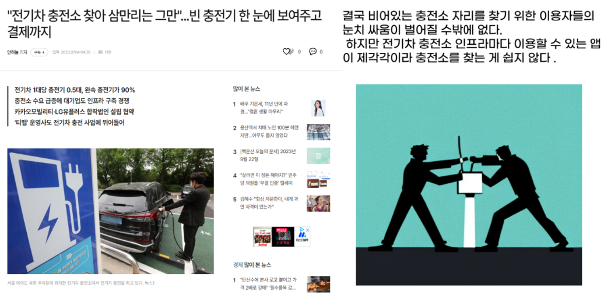

# '어디야?'(Where) - 전기차 충전소
- 개발기간 : 2023/12/28 ~ 2024/01/12
- 인원 : 9명 (FrontEnd 3명, BackEnd 6명)
## 프레임워크 / 언어 / 개발환경
- FrontEnd : (React / JavaScript / VSCode)
- BackEnd : (Spring Boot / Java / STS), (Django / Python / PyCharm)
## 협업툴
- Git/GitHub
- SourceTree
## 시연동영상
https://youtu.be/F-7U2uUm3aY?si=HtSKNcBCeUgTa4Z7
## 개요

  

점점 전기차 수요가 증가하는 요즘, 
“전국에 있는 충전소 위치를 한눈에 파악 할 수 있고, 상태를 실시간으로 볼 수 있는 사이트가 있다면 좋지 않을까?” 라는 의도로 기획
